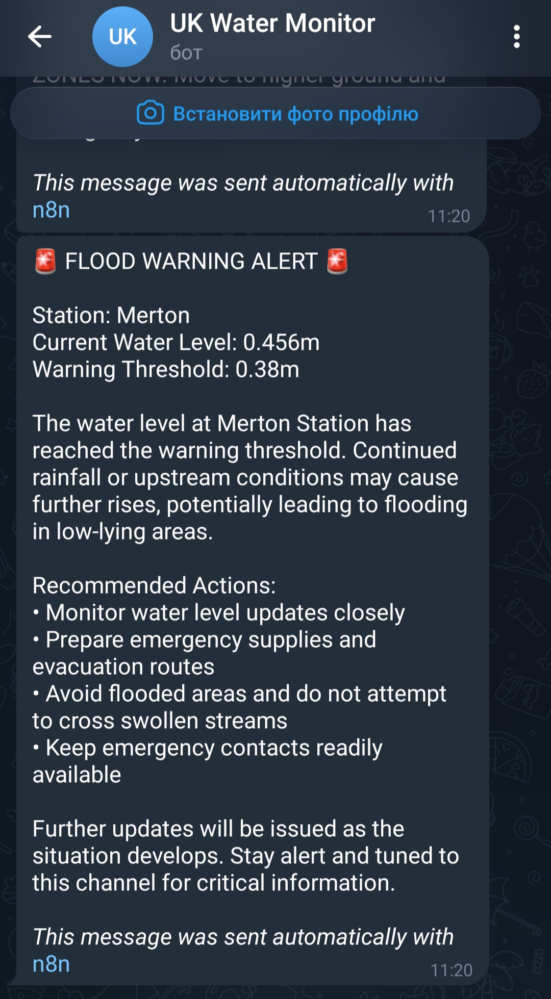
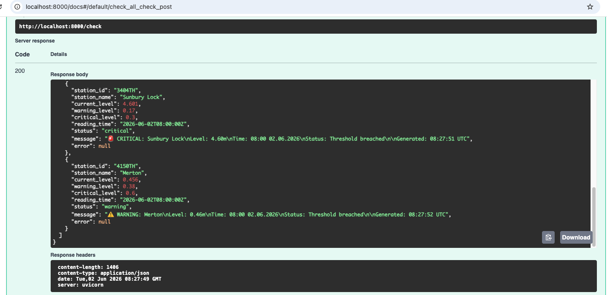
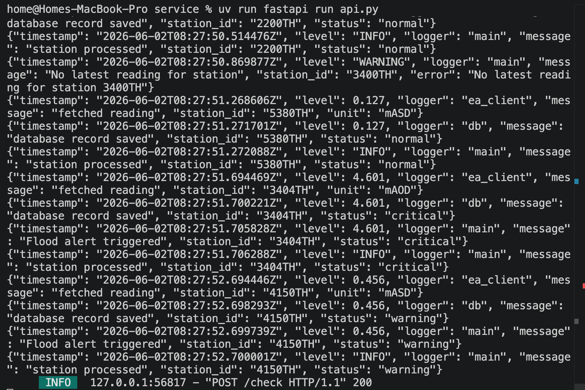

# UK Water Quality Automation

> **Real-time water-level monitoring for UK rivers, with AI-generated breach explanations.**
> Built on the Environment Agency's open Flood Monitoring API.

A working pipeline that monitors 5 stations on the Thames, Lee, and Wandle rivers,
evaluates levels against per-station warning and critical thresholds, persists every
reading for audit, and dispatches Claude-generated explanations to Telegram when
thresholds are breached.

---

## See it working

| Telegram alert                                                                                              | Live API docs                                                                        |
| ----------------------------------------------------------------------------------------------------------- | ------------------------------------------------------------------------------------ |
| (docs/screenshots/010-Telegram-critical_alert.png) | (docs/screenshots/031-fastAPI-docs.png) |

| Sheets audit log                                     | Structured JSON logs                             |
| ---------------------------------------------------- | ------------------------------------------------ |
|  |  |

🎥 **[120-second video walkthrough](https://www.loom.com/share/c82fa25e7887481781d2179b13c344cb)**

---

## Why this exists

The UK Environment Agency publishes free flood warnings, but they're tuned for
public safety at the regional level. Small businesses near rivers — B&Bs, fish
farms, golf courses, campsites — need _per-site custom thresholds_ and routed
alerts. This project demonstrates how to build that on public open data with
no infrastructure cost.

It's also a deliberate exercise in production-grade engineering on top of a
no-code starting point. The system began as a single n8n workflow and is being
incrementally migrated to a tested, type-safe Python service while keeping
n8n as the orchestration layer.

---

## Architecture

\`\`\`
[n8n schedule trigger]
│
▼
[Python FastAPI: /check]
│ (httpx → EA Flood Monitoring API)
│ (Pydantic validation)
│ (threshold evaluation)
│ (SQLAlchemy → SQLite/Postgres)
│
▼
[n8n routing: Switch by status]
│
├── critical/warning ──> [Telegram alert]
└── all readings ──> [Google Sheets audit log]
\`\`\`

See [`docs/architecture.md`](docs/architecture.md) for the full breakdown,
including why the system uses both n8n and Python rather than one or the other.

---

## Stack

- **Python 3.12** with **FastAPI**, **Pydantic v2**, **SQLAlchemy 2.0**
- **httpx** + **tenacity** for resilient API calls
- **pytest** + **pytest-cov** + **pytest-httpx** — 19 tests, 78% coverage
- **GitHub Actions** for CI on every push
- **ruff** for linting and formatting
- **n8n** for orchestration, scheduling, and message routing
- **Anthropic Claude API** for natural-language breach explanations
- **Google Sheets** for audit log
- **Telegram Bot API** for real-time alerts
- **uv** for Python project management

---

## Stations monitored

| Station ID | Name                 | River  | Warning (m) | Critical (m) |
| ---------- | -------------------- | ------ | ----------- | ------------ |
| 2200TH     | Reading              | Thames | 7.0         | 7.3          |
| 3400TH     | Kingston             | Thames | 3.97        | 4.2          |
| 5380TH     | Walthamstow Low Hall | Lee    | 1.35        | 1.50         |
| 3404TH     | Sunbury Lock         | Thames | 0.17        | 0.30         |
| 4150TH     | Merton               | Wandle | 0.38        | 0.60         |

Thresholds are derived from the EA API's `stageScale` and the public flood
warning service. They live in `data/reference/thresholds.csv`.

---

## Run it locally

See [`docs/setup.md`](docs/setup.md) for the full setup walkthrough
(Google OAuth, Telegram bot creation, n8n credentials, etc.).

Quick start once configured:

\`\`\`bash

# Terminal 1 — Python service

cd service
uv sync --dev
uv run fastapi dev api.py

# Terminal 2 — n8n

n8n start
\`\`\`

API docs at http://localhost:8000/docs

---

## Project status

| Milestone                                 | Status         |
| ----------------------------------------- | -------------- |
| V1 — n8n + Sheets + Telegram              | ✅ Shipped     |
| V2 — Python FastAPI service               | ✅ Shipped     |
| V2.1 — Test suite + CI                    | ✅ Shipped     |
| V2.2 — Structured logging                 | ✅ Shipped     |
| V3 — Docker + cloud deployment            | 🚧 In progress |
| V3.1 — LLM eval framework                 | ⏳ Planned     |
| V4 — RAG over historical EA flood reports | ⏳ Planned     |
| V4.1 — Agentic tool use                   | ⏳ Planned     |

---

## Data licensing

Water-level data is provided by the UK Environment Agency under the
[Open Government Licence v3.0](https://www.nationalarchives.gov.uk/doc/open-government-licence/version/3/).
This project is non-commercial and demonstrative.

---

## Author

Built by **Inna Makedonska** as a hands-on AI automation engineering project.
Background: MSc Biology, transitioning to AI engineering.

📧 [LinkedIn] · 💻 [GitHub](https://github.com/makedonskai)
